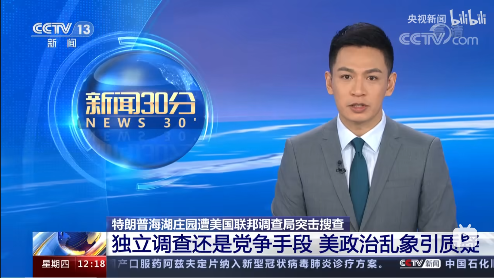
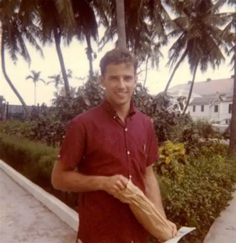

# 唐纳德·特朗普的雾月十八——写于2026年伊始

###一	

​	每晚六点到午夜，我放学回家的那个大十字路口总是站满了乌鸦，成群成列，密密麻麻站在电线杆和树丛中狂啸着。我总是带着恐惧被那叫声吸引，不自觉地走向一棵又一棵呼嚎而看不见任何鸦群的树木。在我到达树下时，整棵树都会陷入短暂地沉默，然后在几秒钟内飞舞而去，发出悠长而抑扬顿挫的狂啸。鸦群在嘲笑我，交头接耳，指目相告，片刻后我的名字将为整座城市知晓，化为他们永恒的笑料，而我骑着车跟在他们后面，脸上挂着跟它们一模一样的笑容。

<figure style="text-align:center;">    <figcaption style="font-size:14px; color:gray;"> 群鸦 </figcaption></figure>

​	卖给我车的人是个活在20年前的年轻人，国际生，美本毕业，即将回到他国内父母的怀中去了。卖我车时他喋喋不休讲述着新自由主义的遗骸，我懵懂点头，他面带优越，我说，“原来如此”，然后摸着碳钎维的车架，把价格压到80刀。

​	我付了钱，他继续感慨，“要是中国像美国一样该有多好！”

​	我说，“那要是选出特朗普总统，该如何呢？”

​	他说，“这只是暂时的......他是作弊上位的！”

​	我说，“是民主选择了他。”

​	他很绅士的对我微笑，“哦？那请阁下给我讲讲什么是民主？”

​	我试了试车灯，“据我所知，他2024年赢得了普选票，选举人票，众议院，参议院，甚至还有大法官团。”

​	他冷冷的说，“这只是暂时的，他马上要中期选举了。”

​	我上了车，扭过头说，“祝你们好运。”

​	他的笑温柔礼貌，像是街上的传销，“你父母在体制内吧？”

​	我笑着说，“那与你无关了”，然后蹬车驶入鸦群中。

###二

​	特朗普先生2016年就任总统，那年我刚刚初中毕业。2018年时他跟中国打贸易战，那年我高二。21年，我坐着大卡车从高考考场回来，身边的同学围成一圈听我讲话。第7个间隔代表第8个球，各位想到了吗？这次的求导是之前三测的原题，各位还记得吗？我满意的看着所有人对我点头，只有右前方的姑娘看着窗外，看着滨江中路的花草泡影般远去，她低头捂着脸，泪如泉涌。22年，大二上，上海刚刚结束封控，FBI开着装甲车飞进海湖庄园，把唐纳德·特朗普抄了家，他的前国务卿和民主党的公卿们笑得跟大丽花似的，举着香槟酒。24年7月，一枚子弹擦破他的耳朵，保镖们扑上去让他卧倒，他挣扎着，站了起来。当时人说，天佑特朗普！4年后看，应该是天佑中华。4个月后，我从《爱弥儿》课后往寝室走，看到冬日的校园无风平静，骑着平衡车的人们来去匆匆，长椅上坐着等待着谁的情侣，这是平凡的一天，美国大选，红色比蓝色多赢了10个点，大局已定。

<figure style="text-align:center;">    <figcaption style="font-size:14px; color:gray;">    2022年，我在上海封城时做完了我的第一个游戏  </figcaption></figure>

​	在我不可触及的远方，历史将这么书写我们这个时代，“二十一世纪20年代，世界秩序在震荡与重组中加速转型......”，接下来他会提及一些令我感到熟悉而陌生的东西：俄乌、巴以、AI、后冷战格局的衰退以及全球右转。我的子孙后代会拿着这本书跪在我的面前，虔诚的向我提问，询问我对人类历史的伟大转折有何感受，而我会告诉他们我对那段时光唯一的记忆就是唐纳德·特朗普。这个时候我会给他们讲这个人是怎么头天给我们国家加了135%的关税，次日就宣称他已经成为中国人民最好的朋友的，所有人都会笑出声来，他们会觉得这是在夸张。就像米兰·昆德拉《生命不可承受之轻》中描写的那样，200万人，600公里，前方是苏联坦克，后面只有手拉着手的人，我此生见过的最长的队列在我初中的女厕所前，那天学校两个厕所炸了一个，我可爱的女同学们双手抱胸，脸上流露出对天地万物乃至她们自己的愤恨。

​	我看《生命不可承受之轻》时初中毕业，刚刚看完《百年孤独》和《斗破苍穹》，我很难讲述炼丹修士、钻石冰晶和历史的伟大进军之间的区别。8年后，我站在列夫·托洛兹基的旧址，进门右拐，看到板房中央正随意摆放着几张照片。简介处，西语字母蜿蜒妖娆，用一种艳丽而冷漠的语调写到：“1989年，波罗的海之路，爱沙尼亚、拉脱维亚、立陶宛的民众走上街头，要求脱离苏联”——坦克坦克坦克，以及站着的人。30年后，唐纳德·特朗普也会成为炼丹修士、钻石冰晶和历史的伟大进军，成为所有非现实的一部分，历史会铭记更加严肃的东西。但是对于我来说，所有这些被历史所铭记的现实都距我遥远，我唯一记得的就是唐纳德·特朗普。

​	我问我自己，难道他就离我近吗？他的家族vlog里，佛罗里达阳光明媚，他美丽的孙女穿着Polo衫，在高尔夫球场乱转捡球。那是一种诗意而富有乐趣的生活，其中有真理的流淌，这种真理的体现有三：其一，他们打高尔夫球，其二，他们吃饭，其三，他们谈论国家大事。我也穿Polo衫，每日八点起床，九点前往学校，在学校里我做三件事情：其一，我学习，其二，我吃饭，其三，我谈论国家大事，而我的同学们视我为怪胎。我想，是那一袋高尔夫球杆阻碍了我的进步，阻碍了我的发展，阻碍了我的哲学水平，这一袋子高尔夫球杆让我和特朗普先生变得遥远了，远的无法触及。

​	然而我确实对他有一种亲切的感觉，这种感觉同样如真理般流淌，从他身上流淌到摄像头，流向屏幕，最后流向我，我只觉得荒谬。我看到拜登下台后的演讲，演讲结束，台下的红脖子老哥找他要总统帽子，他签好把帽子递过去，那老哥顺势递了个MAGA帽子过来，周围人起哄，让他戴上。拜登很温柔的笑了笑，他戴上了，大家都在欢呼，他两握了握手，老哥笑着说，老东西，我敬佩你！在那一瞬间我觉得他和特朗普有些重叠，其实现实也是如此，他们两都是二战末出生的，也都让人想起那个时代。严肃，古典，带着一种从尸体堆里爬出来的温情，但是现在好像有些东西完全不一样了。败选后，拜登说，“不要只在赢的时候才爱你的国家！”，他流下泪来，这滴泪水米尔斯海默也流下了，他当时在博客里说，“美国为什么变成这样了？！”。我想他们不是想讲什么道理，他们只是不太搞得懂这个时代了。特朗普明白吗？倘若旧日的幽灵来到人世，他会看到顶着子弹带货的老挝士兵，直播翻进国会阻止戒严的李在明，少女乐队穿着行政夹克开会，地狱里有抄写《少年维特之烦恼》的拿破仑。

### 三

​	

​	拜登生于1942年，3年后日本人投降，7年后才有新中国；我爷爷也生于1942年，幼年时被乳母背在背上吸手指，头顶上有云有树有太阳，还不时有日本人的轰炸机。拜登可以当我的爷爷，什么是爷爷？就是每次过年坐在最中心的那一桌人，花白脑袋，不说话，只有我走过去才会看着我说“好孙儿”，然后给我递一个红包。拜登就可以做在那桌人里面，弓背看碗不说话，只在我走过去时给我发红包。而我会像NPC一样回复他，先给他说新年快乐，再祝他身体健康，他会说，“你也快乐”，然后说，“乖孙，好好儿学习哟”。

​	1942年，他们都是小的不能再小的小朋友，20年后，他们开始认知这个世界，拜登在法学院打橄榄球，反越战；而我的爷爷则刚刚读完高中，准备去读干部培训班然后当老师了。再过20年，

<figure style="text-align:center;">    <figcaption style="font-size:14px; color:gray;">    拜登先生有与笔者相近的容颜  </figcaption></figure>

​	许多年来我一直在思考自己，然后抱怨我的父母和同学是如何的不理解我，以至于我承担着这种世界性的孤单。后来我才发现我的父母也曾是年轻人，曾与我一样畅想着遥远而漫长的现实，同样迷茫，并忍受着求而不得。老家乡下，我给爷爷上香磕头后，父亲指着远处郁郁葱葱的山坡，说他以前每天都要走一个小时山路去学校，下课再走一个小时回来。然后他左转90度，指着低谷的一片树林说你爷爷文革时曾躲在那里，有其他县的干部想要整他。我追问他，那个时候你们吃什么？住什么？几次的运动有没有塑造你的观念，又是如何影响了你的人生？我希望听到记忆的只言片语，获得一种无奈，一种美学，一种关于美好愿景和灾难现实的辩证看法。他面带迷茫思索片刻，只是告诉我当时很艰苦，他希望能多些吃的。

​	许多年后，我才终于明白时光在所有人身上平等流过的道理，我从对于历史事件的喜爱中解脱出来，关注于历史本身，并意识到事物普遍的连续与关联。在那个瞬间之后，我得知了校门口卖手抓饭的姐姐生于2002年，长我一岁；意识到我的外公肚子上的伤疤来自文革；意识到89年学潮时我父母也在场，而91年苏联解体时他两正在读大学；意识到镇压学潮，带领中国走向现代化的那个人70年前也曾加入学潮，1919年，他14岁，跟他一起上街游行，高呼“废除二十一条”的那些人里面，或许有他喜欢的女生。

​	

​	那是1980年，上个世纪的残影。对于

​	

每天下午3点，在绵密温柔的黑暗中睁开眼，远处模模糊糊传来装修电钻和装订机的响声；闭上眼，感到自己被时间包裹，皮肤微微发汗，有什么东西随时间一起永恒持续，空调吞吐气体的低鸣。我想起初、高中午间的夏日，在正午最灿烂的阳光里关门，拉上窗帘，阳光从门缝和窗帘边上渗入教室，形成无处不在，略微泛着棕黄的黑暗。那是一个甜蜜温润、由53个模模糊糊的灵魂共同组成的梦境，从意识模糊处一直持续到醒来。你起身，看到你的邻座，远桌和喜欢的那个人都埋着脑袋睡觉，你意识到你做错了什么，于是你低头闭上眼，远处传来蝉鸣。我不明白究竟发生了什么，是什么力量让我度过高中来到了大学，为什么我就这么昏睡着度过了近10年，我不明白时光为什么这样不知觉的流淌——明明这母亲一样的黑暗并没有离我远去。

40年后，中国的国家主席会说自己玩过原神和明日方舟，神圣性在消亡，神圣性永恒的消亡，从马克思的共产党宣言开始，从吴夫人把传国玉玺摔倒地上那一刻就开始消亡！甚至还在在那之前，一直追溯到不可追溯的时代，因为历史的神圣性从来不会消亡，历史的神圣性正来自于消亡。

